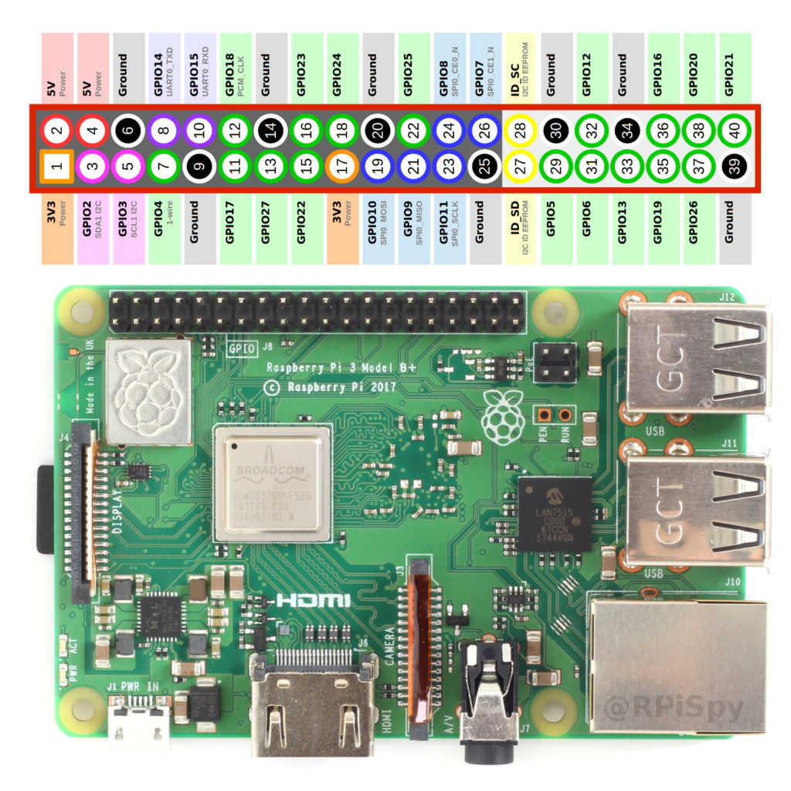
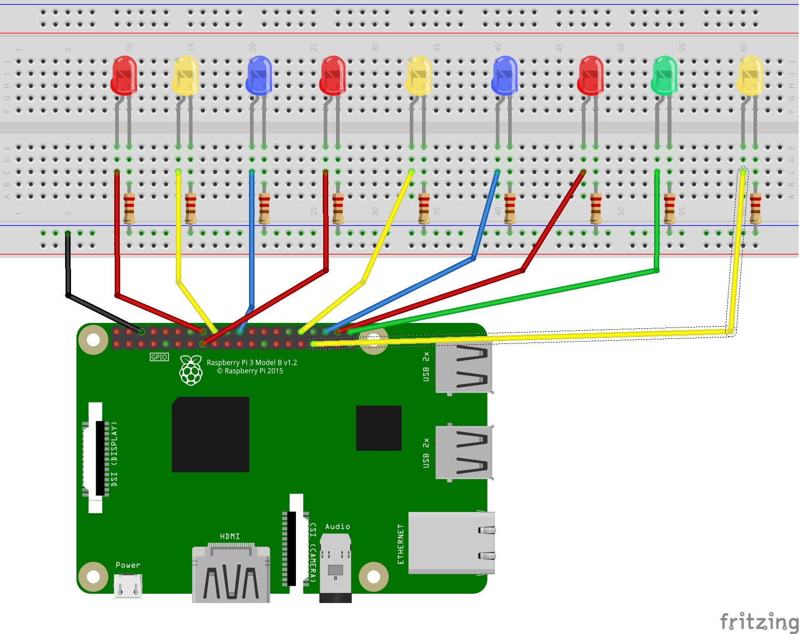

# RESTful Pi
This is a Flask app written in Python3. This app is a REST API backend to control the GPIO pins (turn on and off LEDs) of a Raspberry Pi by making HTTP requests to the `/pins` and `/pins/<id>` endpoints of the Flask webserver.

## HTTP Methods
These requests use the standard HTTP requests `GET`, `POST`, `PUT`, and `DELETE`.

The JSON model of the `pin` resource is:
```json 
    {
        "id": "Integer(readonly=True, description='The pin unique identifier')",
        "pin_num": "Integer(required=True, description='GPIO pin associated with this endpoint')",
        "color": "String(required=True, description='LED color')",
        "state": "String(required=True, description='LED on or off')"
    }
```

The 4 HTTP verbs correspond to the typical CRUD operations:
- POST `pins/` : **Create** a new pin
    - where the posted data is JSON looking somethign like the following:
        ```json
        {
            "pin_num": 23,
            "color": "red",
            "state": "on"
        }
        ```
- GET `pins/`: Fetech (**Read**) all pins stored on the system
    - e.g:
      ```json
        {
            "id": "1",
            "pin_num": 23,
            "color": "red",
            "state": "on"
        },
        {
            "id": "2",
            "pin_num": 24,
            "color": "blue",
            "state": "off"
        }
        ```
 - GET `pins/<id>`: Fetch a pin given its resource identifier
    - e.g. GET `pins/2`:
    ```json
        {
            "id": "2",
            "pin_num": 24,
            "color": "blue",
            "state": "off"
        }
    ```
 - PUT `pins/<id>` : **Update** a pin given its resource id
    - You can update a single field, or all fields (except for its uid which is READONLY)
    - e.g. Update the state of pin with id 2:
        - PUT `/pins/2` 
            ```json
            {"state": "off"}
            ```
     - e.g. Update all fields of pin with id 2:
        - PUT `/pins/2` 
            ```json
            {
                "pin_num": 24,
                "color": "blue",
                "state": "off"
            }
            ```
 - DELETE `pins/<id>` : **Delete** pin<id> from system
    
## Breadboard Setup
For this project to work without modifying the code, you will need:
- 9 x (preferably multicolored leds, 3xR,1xG,2xB,3xY in my case)
- 9 x 1k resistors (anything over 100Ω should be fine)
- 1 x breadboard
- 10 x GPIO connecting cables

There are many kits available on Amazon for under $20.
    
### GPIO Pins
This code uses the following configuration:
```json
{"pin_num": 23, "color": "red",}
{"pin_num": 24, "color": "yellow"},
{"pin_num": 25, "color": "blue"},
{"pin_num": 22, "color": "red"},
{"pin_num": 12, "color": "yellow"},
{"pin_num": 16, "color": "blue"},
{"pin_num": 20, "color": "red"},
{"pin_num": 21, "color": "green"},
{"pin_num": 13, "color": "yellow"}
```
*Note*: **These pin numbers refer to the GPIO pin numbers, not the generic numbering**


### Schematic


## Running
Once you have your board setup and connected to the Pi and have a connection to your Raspberry Pi, either remotely via SSH(check out my [tutorial](https://www.youtube.com/watch?v=Lr3LLpVBSUk) on SSH access) or locally through a desktop OS on your Raspberry Pi:
- `git clone https://github.com/avcourt/restful-pi2/`
- `cd restful-pi`
- `sudo apt install python3-pip`
- `pip3 isntall -r requirements.txt`
- `python3 app`

If you are running this locally on the pi with a desktop, point your browser at localhost:5000 and you will be greeted by a SwaggerUI to make HTTP requests.

If you developing remotely through SSH access you will have to create a SSH tunnel from your localmachine to the raspberry pi in order to access the SwaggerUI. Check out [this](video) video for hwo to do that.

Once you're tired of manually sending HTTP requests through Swagger(curl), open a Python3 shell in this repo's root directory:
- `python3`
- `import control.py`
- test out some of the functions:
    - `toggle_color(color: str, state: str)`
    - `switch_all(state: str)`
    - `all_on()`
    - `all_off()`
    - `color_on(color: str)`
    - `color_off(color: str)`
    - `random_stuff()`
    - `rainbow(period=0.5)`
    - `on_off(period=0.5)`
    - `wave(period: float)`
    - `single_rand(period: float)`

e.g.:
`control.color_on("red")`

Try making your own fucntions or messing around with the ones included in this repo.

## Cleanup
`pip3 uninstall -r requirements.txt`

